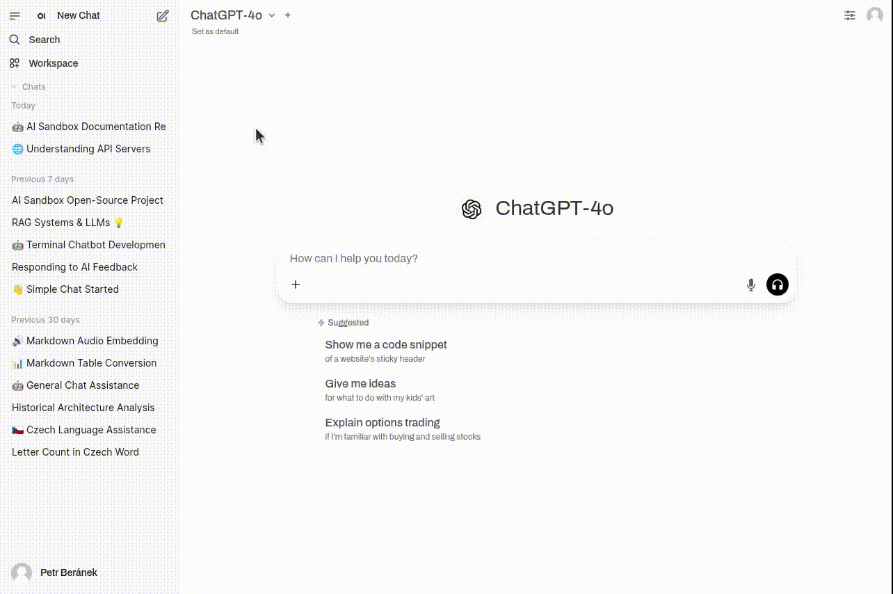

# AI Sandbox
An open-source implementation of the [Harvard AI Sandbox](https://huit.harvard.edu/ai-sandbox). This project aims to provide a secure, modular environment for working and experimenting with generative AI.

_Above: Open WebUI serving as graphical user interface of the AI Sandbox._

## Components

### Graphical User Interface
#### Open WebUI
Popular, feature-rich Web UI for interacting with large language models (chatbot interface). Installable both on desktop (single user) and on a server (multi user).
* [Installation](https://docs.openwebui.com/getting-started/quick-start/)
* [Documentation](https://docs.openwebui.com/)

### Inference Servers
#### Ollama
Well integrated with Open WebUI. Not optimized for multiuser environments (consider using vLLM instead).
* [Installation](https://github.com/ollama/ollama/blob/main/README.md)
* [Documentation](https://github.com/ollama/ollama/tree/main/docs#documentation)
* [Models](https://ollama.com/search)

#### vLLM
Fast LLM inference. Installation and model deployment may be more complex than Ollama.
* [Installation](https://docs.vllm.ai/en/stable/getting_started/installation/index.html)
* [Documentation](https://docs.vllm.ai/en/stable/)

## Roadmap
* Implementation of spending limits for external models (in progress).
* Finding an optimal embedding model for Czech, which is necessary for Open WebUI's _Knowledge_ feature.
* Testing integration of multiple external providers (e.g. Anthropic and Google) via LiteLLM proxy server.
