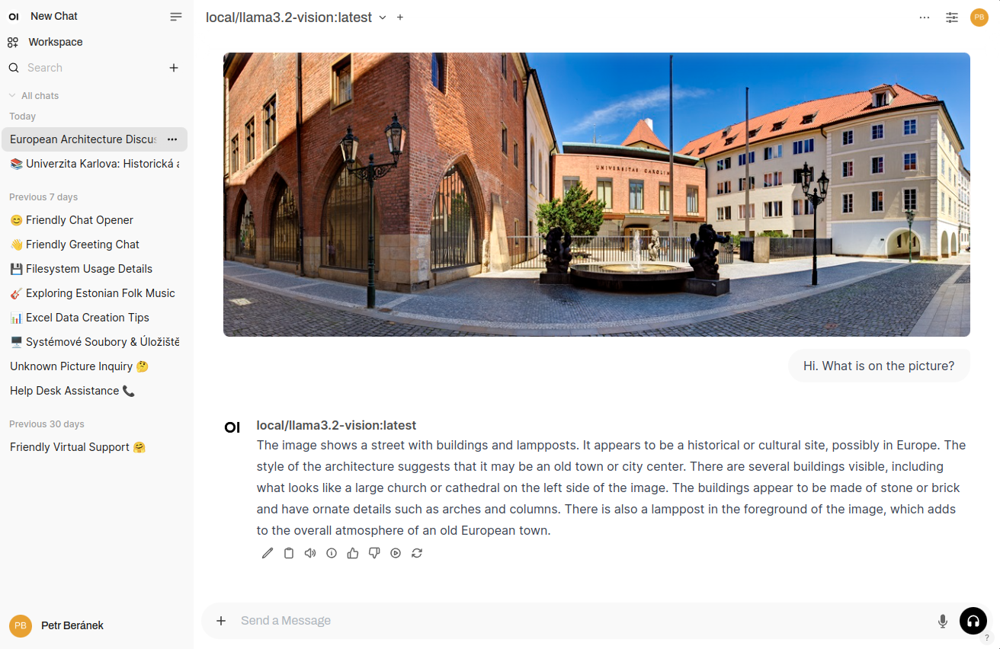

# AI Sandbox

> [!WARNING]
> This guide is still a work in progress (WIP). Some things may be incomplete or broken. PRs welcome!

Opinionated deployment guide for an AI sandbox, based on [Open WebUI](https://docs.openwebui.com/) and [Ollama](https://ollama.com/)



## About

Inspired by [Harvard AI Sandbox](https://huit.harvard.edu/ai-sandbox), the goal of this application is to provide an **easy-to-access and secure environment** for experimenting and working with Generative AI. _Easy-to-access_ means the sandbox may run as a multi-user web app (supporting multiple authentication methods) or as a private instance on a personal computer. _Secure_ means the data entered will not be, by default, used for training of any large language model (LLM).

### Features Include

* Support for multiple models of Generative AI.
* The ability to upload multiple files.
* Image generation.
* Tools (e.g. [web search](https://docs.openwebui.com/tutorials/integrations/web_search)) and [artifacts](https://docs.openwebui.com/features/code-execution/artifacts/).
* [Customized models (assistants)](https://docs.openwebui.com/features/workspace/models) and [Knowledge](https://docs.openwebui.com/features/workspace/knowledge) for better responses.
* Speech-to-text and text-to-speech capabilities.
* Multilingual support (including Czech).

For the full list of features see [Open WebUI Features](https://docs.openwebui.com/features/).

### Additional Benefits

* Built-in support for running [open-source models](https://ollama.com/search).
* The ability to connect to virtually any 3rd party vendor via [Functions and Pipelines](https://docs.openwebui.com/features/plugin/) (e.g. OpenAI (built-in), [Anthropic](https://openwebui.com/f/justinrahb/anthropic), [Google](https://openwebui.com/f/justinrahb/google_genai), [Azure OpenAI](https://openwebui.com/f/nomppy/azure), and [more](https://openwebui.com/functions)). Make sure to **audit any source code** before importing it into the Open WebUI, and to **read the 3rd party API terms and conditions** to keep your data secure.
* It may be difficult for institutions to get acceptable offerings from companies like OpenAI, Anthropic or Google for their chatbots, especially when aiming for gradual and cost-effective deployment. Enterprise subscriptions often require high minimum commitments, while using these services via their APIs (which the sandbox enables) allows for pay-as-you-go pricing that can be much cheaper for many users.
* Being composed from popular open-source projects ([Open WebUI](https://docs.openwebui.com/), [Ollama](https://ollama.com/), [Nginx](https://nginx.org/en/), [Watchtower](https://containrrr.dev/watchtower/)), the sandbox is modular and extensible.
* Providing users with an easy-to-access and secure environment mitigates their motivation to use Shadow AI, i.e., unknown, unapproved, and potentially unsafe AI tools.

## Installation

> [!NOTE]
> This guide covers server deployment. If you prefer to run the sandbox on your own computer, follow [the desktop deployment guide](desktop_deployment.md).

Prerequisites:
* A Linux server for hosting (tested on Ubuntu 24.04.1 LTS (server))
* SSL certificate for HTTPS

Install [Docker](https://docs.docker.com/engine/install/ubuntu/) (make sure to include Docker Compose).

If you have Nvidia GPU, install Nvidia Container Toolkit. You can follow instructions in the [Ollama documentation](https://github.com/ollama/ollama/blob/main/docs/docker.md).

Install git:
```bash
sudo apt install git
```

Clone this repository:
```bash
git clone https://github.com/peberanek/ai-sandbox.git
cd ai-sandbox
```

Copy your SSL certificate to `ssl/`:
```bash
mkdir ssl
cp path/to/your_ssl_certificate ssl/nginx.crt  # Nginx expects this filename!
cp path/to/your_ssl_private_key ssl/nginx.key  # Nginx expects this filename!
```

Modify `conf.d/open-webui.conf` according to your network setup (see TODO in the file).

> [!NOTE]
> For production environments it is recommended to pin a release tag of Open WebUI and Ollama to prevent [update issues](https://github.com/open-webui/open-webui/issues/8074):
> ```bash
> cp .env.example .env
> ```
> Then modify contents of `.env` according your preferences, e.g.:
> ```
> OLLAMA_DOCKER_TAG='0.5.4'
> WEBUI_DOCKER_TAG='v0.4.8'
> ```

If necessary, modify `docker-compose.yml` according to your setup (see TODO in the file).

Pull and run the Docker compose (this may take some time):
```bash
docker compose up -d
```

Once the compose is running, the web interface (Open WebUI) should be available at https://YOUR_DOMAIN_OR_IP. It may take some time to Nginx to serve it.

## Updates

Nginx is updated automatically by Watchtower. Open WebUI and Ollama need manual update.

First, stop the compose and remove all components (containers, networks, ...):
```bash
docker compose down
```

If you pinned specific release tags in `.env`, update them accordingly.

Then run the compose again:
```bash
docker compose up -d
```

## Configuration (WIP)

### Open WebUI

> [!IMPORTANT]
> **Admin Creation**: The first account created on Open WebUI gains Administrator privileges, controlling user management and system settings. (Administrator priviledges of this account cannot be removed.)
>
> **User Registrations**: Subsequent sign-ups start with Pending status, requiring Administrator approval for access. (New sign-ups are disabled by default. Click on your name in the bottom left corner, then see _Admin panel > Settings > General Settings > Enable New Sign Ups_)

TODO: configure models, external connections

TODO: resolve `WARNING: CORS_ALLOW_ORIGIN IS SET TO '*' - NOT RECOMMENDED FOR PRODUCTION DEPLOYMENTS.` (https://github.com/open-webui/open-webui/pull/4714)

TODO: setup a reasonable update time and interval for Watchtower. It seems the default behavior is run-once. No more checks then!
